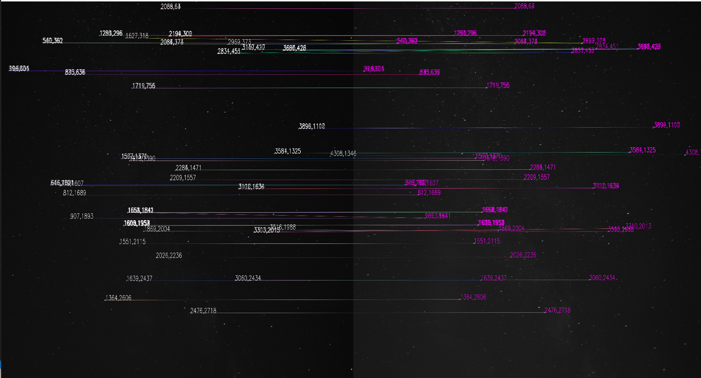
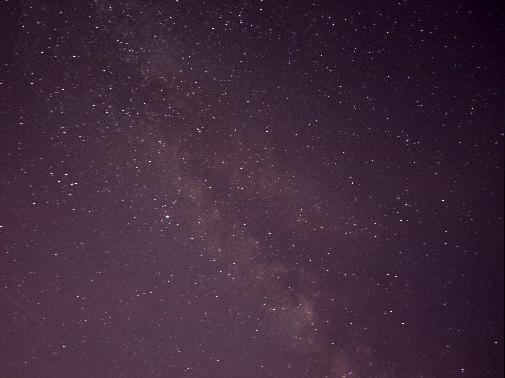

# Night Sky Image Stacker

This repo uses OpenCV to enhance a set of images that are taken by short intervals on tripods.
What it does is basically stacking all the image sequences together while providing image coregistration.

1. Extract keypoints by ORB
2. Match keypoints in subsequent images with the first image  

3. Find homography matrix for each matrix
4. Perspective transform and stack together. 
5. Adjust the brightness and contrast of the image. (configurable)  

### Current issues: 
- The keypoints shouldn't be separated away by too much distance so that matching does not recognize them. 
- An assumption has been made to the shifting of the keypoints: Horizontal shift happens amongst the keypoints.
